# Solutions to Challenges
The code for 3,4 and 5 challenge is in file named 3_4_5.cpp


The tests collectively aim to validate the accuracy, reliability, and computational efficiency of the defined logarithmic number system (LNS) data types.


# Challenge 1

## **Test 1: Summing Odd Numbers**

* Purpose: Computes the sum of the first 10,000 odd numbers using both floating-point arithmetic and logarithmic number system (LNS).  
* Usage: Validates LNS arithmetic for simple addition operations and compares accuracy with floating-point results.

## **Test 2: Series Summation of Reciprocal Factorials**

* Purpose: Computes the summation of a series where each term is the reciprocal of a factorial   
* Usage: Tests LNS arithmetic for division and multiplication in series computations and compares results with floating-point arithmetic.

## **Test 3: Alternating Series with Factorial Progression**

* Purpose: Computes a series with alternating signs and factorial-like progression   
* Usage: Validates LNS arithmetic for handling negation, multiplication, and alternating series computations.

## **Test 4: Mandelbrot Set Visualization**

## Mandelbrot Set Plot

**Purpose**
Plots the Mandelbrot set.

**Explanation**
The Mandelbrot set is generated by iterating over points in the complex plane and determining whether their magnitude exceeds a certain threshold.

Each point is computed iteratively using the formula:

$$
z_{n+1} = z_n^2 + c
$$

where **c** is the complex coordinate. Points inside the set are marked with an asterisk (`*`), while points outside are left blank.

* Usage: Tests whether LNS arithmetic can accurately replicate floating-point results for iterative computations in fractal generation.

## **Test 5: Approximating π via Series**

* Purpose: Approximates π using a series   
* Usage: Validates LNS arithmetic for alternation, division, and summation in approximating mathematical constants.

## **Arithmetic Test**

* Purpose: Compares arithmetic operations (addition, subtraction, multiplication, division, negation, square root, etc.) between floating-point numbers and LNS representations for two sample inputs (e.g., 35.7 and 7).  
* Usage: Ensures that LNS operations produce results consistent with floating-point arithmetic.


## For xlns 16:  
### Tests numbered 1,2,3,5
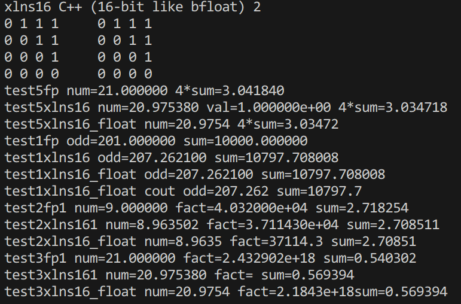

### Mendelbrot Set for fp
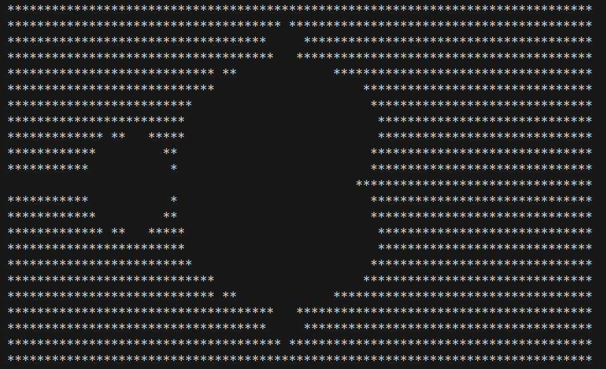
### Mendelbrot Set for xlns16
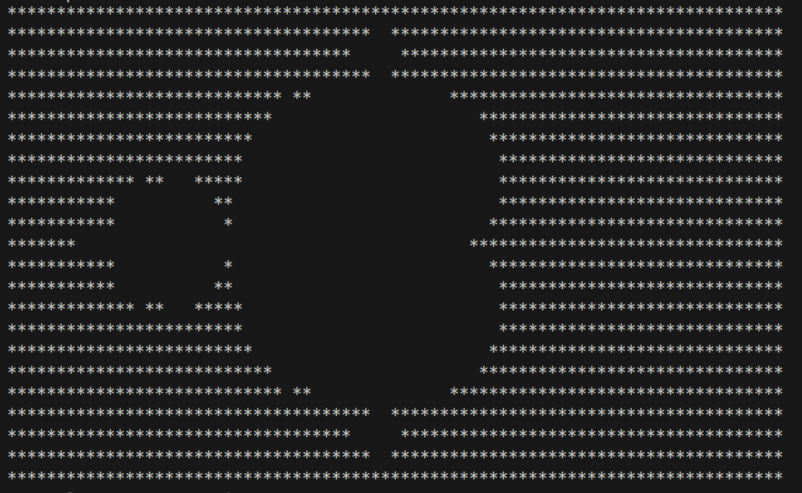
### Mendelbrot Set for xlns16_float
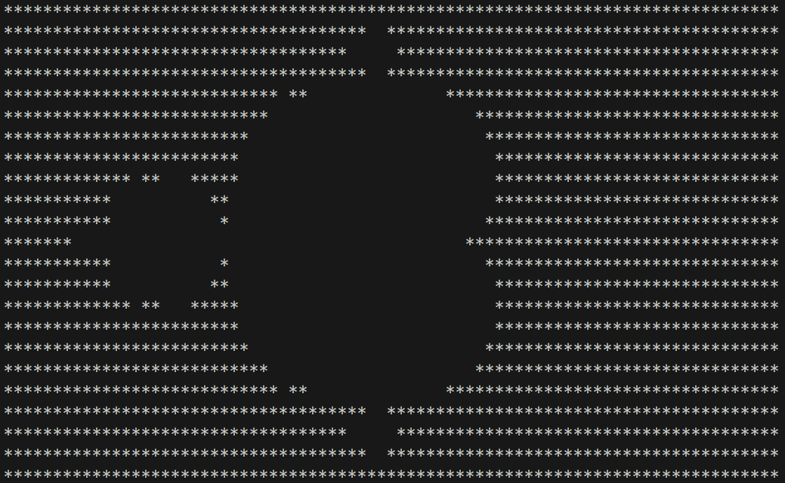

### Arithematic Tests
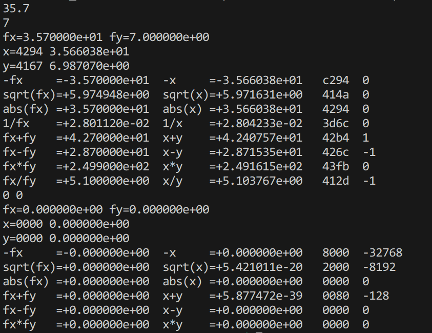

## For xlns 32

### Tests numbered 1,2,3,5
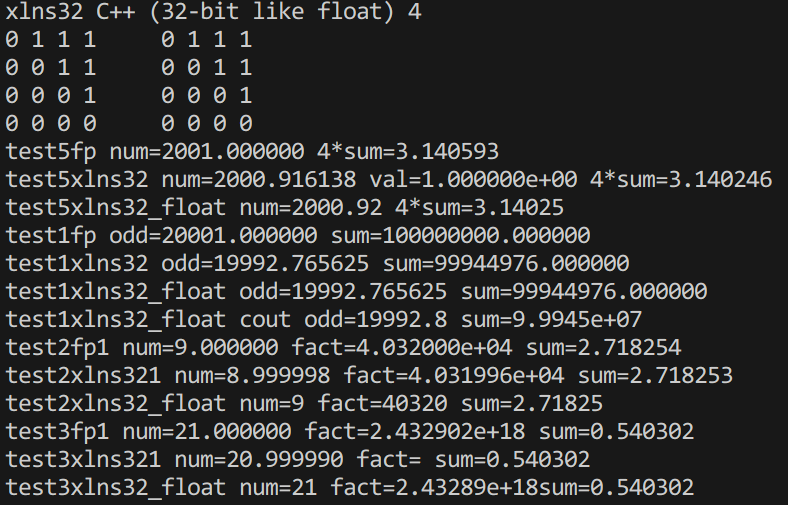

### Mendelbrot Set for fp
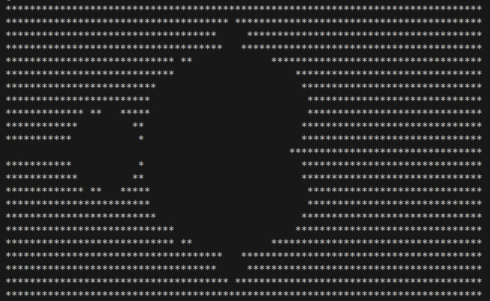
### Mendelbrot Set for xlns32
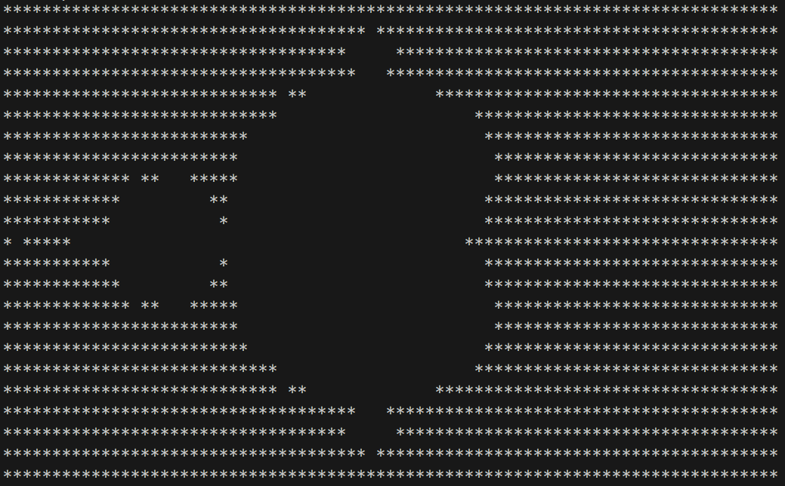
### Mendelbrot Set for xlns32_float
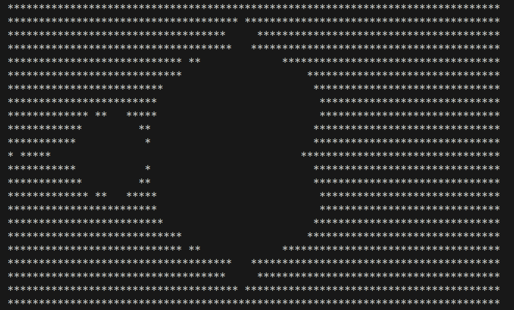
### Arithematic Tests
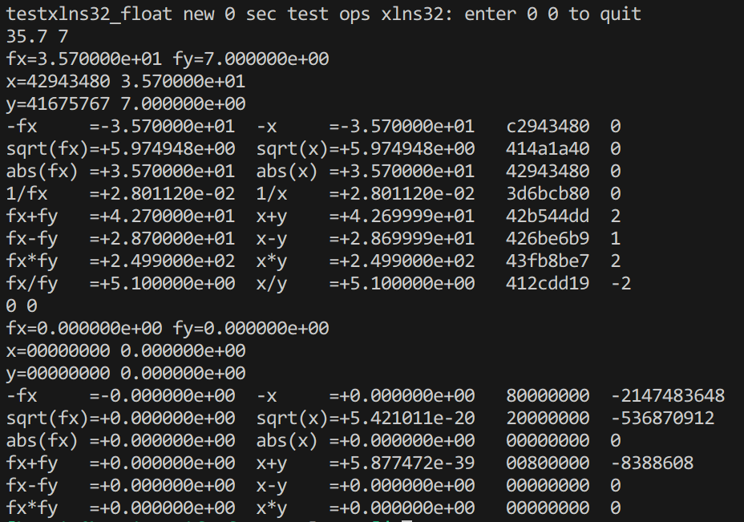

# Challenge 2  
I have thoroughly reviewed the tutorial and explored the codebase of ggml to gain a solid understanding of its functionality. This has provided me with the necessary knowledge and confidence to implement the project effectively and efficiently. This can be seen in the previous sections of problem statement and its solution.

# Challenge 3,4 and 5
The output demonstrates that computations using floating-point arithmetic and xlns32\_float yield accurate results. However, results obtained with xlns16\_float are less precise, indicating that the reduced precision of xlns16\_float leads to lower accuracy compared to the other formats.

Code Output

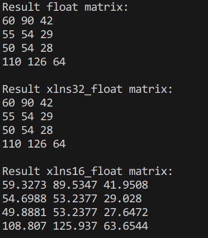


CPP CODE:

```cpp
#define xlns_ideal

#include "xlns32.cpp"
#include "xlns16.cpp"
#include <iostream>

using namespace std;


float** fp(float** A, int m, int p, float** B, int n) {
    float** C = new float*[m];
    for (int i = 0; i < m; i++) {
        C[i] = new float[n];
        for (int j = 0; j < n; j++) {
            C[i][j] = 0.0f;
        }
    }
    for (int i = 0; i < m; i++) {
        for (int j = 0; j < n; j++) {
            for (int k = 0; k < p; k++) {
                C[i][j] += A[i][k] * B[k][j];
            }
        }
    }
    return C;
}


float** transpose(float** mat, int m, int n) {
    float** result = new float*[n];
    for (int i = 0; i < n; i++) {
        result[i] = new float[m];
    }
    for (int i = 0; i < m; i++){
        for (int j = 0; j < n; j++){
            result[j][i] = mat[i][j];
        }
    }
    return result;
}

xlns32_float** matMul_xlns32(xlns32_float** A, int m, int p, xlns32_float** B, int n) {
    xlns32_float** C = new xlns32_float*[m];
    for (int i = 0; i < m; i++) {
        C[i] = new xlns32_float[n];
        for (int j = 0; j < n; j++) {
            C[i][j] = 0;
        }
    }
    for (int i = 0; i < m; i++){
        for (int j = 0; j < n; j++){
            for (int k = 0; k < p; k++){
                C[i][j] += A[i][k] * B[k][j];
            }
        }
    }
    return C;
}

xlns32_float** transpose(xlns32_float** mat, int m, int n) {
    xlns32_float** result = new xlns32_float*[n];
    for (int i = 0; i < n; i++) {
        result[i] = new xlns32_float[m];
    }
    for (int i = 0; i < m; i++){
        for (int j = 0; j < n; j++){
            result[j][i] = mat[i][j];
        }
    }
    return result;
}


xlns16_float** matMul_xlns16(xlns16_float** A, int m, int p, xlns16_float** B, int n) {
    xlns16_float** C = new xlns16_float*[m];
    for (int i = 0; i < m; i++) {
        C[i] = new xlns16_float[n];
        for (int j = 0; j < n; j++) {
            C[i][j] = 0;
        }
    }
    for (int i = 0; i < m; i++){
        for (int j = 0; j < n; j++){
            for (int k = 0; k < p; k++){
                C[i][j] += A[i][k] * B[k][j];
            }
        }
    }
    return C;
}

xlns16_float** transpose(xlns16_float** mat, int m, int n) {
    xlns16_float** result = new xlns16_float*[n];
    for (int i = 0; i < n; i++) {
        result[i] = new xlns16_float[m];
    }
    for (int i = 0; i < m; i++){
        for (int j = 0; j < n; j++){
            result[j][i] = mat[i][j];
        }
    }
    return result;
}


template<typename T>
void printMat(T** mat, int m, int n) {
    for (int i = 0; i < m; i++){
        for (int j = 0; j < n; j++){
            cout << mat[i][j] << " ";
        }
        cout << endl;
    }
    cout << endl;
}


template<typename T>
void freeMat(T** mat, int m) {
    for (int i = 0; i < m; i++){
        delete[] mat[i];
    }
    delete[] mat;
}

int main() {
    

    int m = 4, p = 2, n = 3;
    
    float** A_fp = new float*[m];
    A_fp[0] = new float[p]{2.0f, 8.0f};
    A_fp[1] = new float[p]{5.0f, 1.0f};
    A_fp[2] = new float[p]{4.0f, 2.0f};
    A_fp[3] = new float[p]{8.0f, 6.0f};
    

    float** B_fp = new float*[n];
    B_fp[0] = new float[p]{10.0f, 5.0f};
    B_fp[1] = new float[p]{9.0f, 9.0f};
    B_fp[2] = new float[p]{5.0f, 4.0f};
    
    
    float** B_fp_T = transpose(B_fp, n, p);
    float** result_fp = fp(A_fp, m, p, B_fp_T, n);
    cout << "Result float matrix:" << endl;
    printMat(result_fp, m, n);
    


    xlns32_float** A_x32 = new xlns32_float*[m];
    A_x32[0] = new xlns32_float[p];
    A_x32[1] = new xlns32_float[p];
    A_x32[2] = new xlns32_float[p];
    A_x32[3] = new xlns32_float[p];

    for(int i = 0;i<m;i++){
        for(int j = 0;j<p;j++){
            A_x32[i][j] = A_fp[i][j];
        }
    }

    
    xlns32_float** B_x32 = new xlns32_float*[n];
    B_x32[0] = new xlns32_float[p];
    B_x32[1] = new xlns32_float[p];
    B_x32[2] = new xlns32_float[p];
    
    for(int i = 0;i<n;i++){
        for(int j = 0;j<p;j++){
            B_x32[i][j] = B_fp[i][j];
        }
    }
    
    xlns32_float** B_x32_T = transpose(B_x32, n, p);
    
    xlns32_float** result_x32 = matMul_xlns32(A_x32, m, p, B_x32_T, n);
    cout << "Result xlns32_float matrix:" << endl;
    printMat(result_x32, m, n);
    

    xlns16_float** A_x16 = new xlns16_float*[m];
    A_x16[0] = new xlns16_float[p];
    A_x16[1] = new xlns16_float[p];
    A_x16[2] = new xlns16_float[p];
    A_x16[3] = new xlns16_float[p];

    for(int i = 0;i<m;i++){
        for(int j = 0;j<p;j++){
            A_x16[i][j] = A_fp[i][j];
        }
    }
    

    xlns16_float** B_x16 = new xlns16_float*[n];
    B_x16[0] = new xlns16_float[p];
    B_x16[1] = new xlns16_float[p];
    B_x16[2] = new xlns16_float[p];

    for(int i = 0;i<n;i++){
        for(int j = 0;j<p;j++){
            B_x16[i][j] = B_fp[i][j];
        }
    }
    
    xlns16_float** B_x16_T = transpose(B_x16, n, p);
    
    xlns16_float** result_x16 = matMul_xlns16(A_x16, m, p, B_x16_T, n);
    cout << "Result xlns16_float matrix:" << endl;
    printMat(result_x16, m, n);
    
    
    // Free the space
    freeMat(A_fp, m);
    freeMat(B_fp, n);
    freeMat(B_fp_T, p);
    freeMat(result_fp, m);
    
    freeMat(A_x32, m);
    freeMat(B_x32, n);
    freeMat(B_x32_T, p);
    freeMat(result_x32, m);
    
    freeMat(A_x16, m);
    freeMat(B_x16, n);
    freeMat(B_x16_T, p);
    freeMat(result_x16, m);
    
    return 0;
}
```